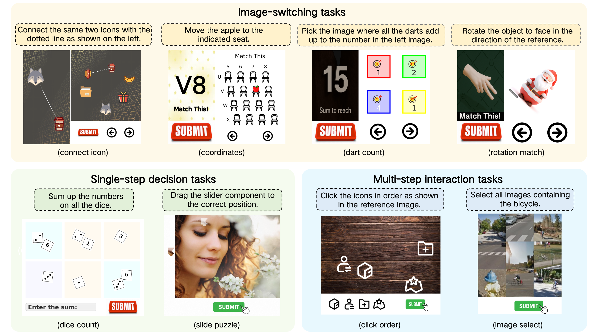

# [EMNLP 2026] CaptchaMind: Training CAPTCHA Solvers via Reinforcement Learning with Explicit Reasoning Supervision

<h2 align="center">🎉🎉 Accepted to EMNLP 2026 Main Conference! 🎉🎉</h2>

<p align="center">
  <a href="https://arxiv.org/abs/2605.19538"></a>
  <a href="https://huggingface.co/AIDC-AI/CaptchaMind-7B"></a>
  <a href="https://huggingface.co/datasets/AIDC-AI/Captcha"></a>
  <a href="./LICENSE"></a>
</p>

> **TL;DR** — CaptchaMind is the first *training-based* CAPTCHA solver. We build **CaptchaBench**, a 16,000-sample benchmark with process-level annotations, and train a Qwen2.5-VL-7B model with an RL framework that **explicitly supervises the model's reasoning process** by rewarding correct grounding of task-relevant visual regions at intermediate steps. CaptchaMind reaches **82.9%** average success across eight tasks and **71.0%** on real-world CAPTCHAs — surpassing all closed-source-API and agentic baselines.

<p align="center">
  
  <br>
  The eight CAPTCHA task types in CaptchaBench.
</p>

---

## 📋 Table of Contents

- [📢 News](#-news)
- [🔗 Resources](#-resources)
- [📖 Overview](#-overview)
- [🏗 Project Structure](#-project-structure)
- [⚙️ Installation](#-installation)
- [📦 Dataset](#-dataset)
- [🤖 Model & Inference Server](#-model--inference-server)
- [🚀 Quick Start / Evaluation](#-quick-start--evaluation)
- [📊 Results](#-results)
- [🗺️ Roadmap](#-roadmap)
- [📝 Citation](#-citation)
- [📄 License](#-license)
- [🙏 Acknowledgements](#-acknowledgements)

---

## 📢 News

- **[2026-08-21]** 🎉 CaptchaMind has been accepted to the **EMNLP 2026 Main Conference**!
- **[2026-06-05]** We release the CaptchaBench dataset and CaptchaMind-7B model weights. 🎉
- **[2026-05-20]** Our paper is available on [arXiv](https://arxiv.org/abs/2605.19538), along with the evaluation code.

---

## 🔗 Resources

| Resource | Link |
| --- | --- |
| 📄 Paper | https://arxiv.org/abs/2605.19538 |
| 🤖 Model (CaptchaMind-7B) | https://huggingface.co/AIDC-AI/CaptchaMind-7B |
| 🗂️ Dataset (CaptchaBench) | https://huggingface.co/datasets/AIDC-AI/Captcha |

---

## 📖 Overview

CaptchaMind is the first training-based CAPTCHA solver. We release **CaptchaBench** — 16,000 programmatically generated samples across 8 task types (2,000 train + 200 test each) with region- and process-level annotations — and a **CaptchaMind-7B** model (Qwen2.5-VL-7B), trained in two stages (SFT followed by GRPO-based RL with explicit supervision of intermediate region grounding). See the [paper](https://arxiv.org/abs/2605.19538) for method details.

This repository provides the **CaptchaBench environments and evaluation harness**.

### Task types

| Category | Tasks |
| --- | --- |
| **Image-switching** | `connect_icon`, `coordinates`, `dart_count`, `rotation_match` |
| **Multi-step interaction** | `click_order`, `image_select` |
| **Single-step decision** | `dice_count`, `slide_puzzle` |

Our task taxonomy is inspired by [OpenCaptchaWorld](https://github.com/MetaAgentX/OpenCaptchaWorld) (Luo et al., 2025); all CaptchaBench samples are independently and programmatically generated by us.

---

## 🏗 Project Structure

```text
captcha-mind/
├── captcha/
│   ├── run.py                  # Entry point: per-task batch evaluation functions
│   ├── data_types.py           # Action / EnvResponse / SolveResult dataclasses
│   ├── agents/
│   │   ├── base.py             # Abstract Agent interface
│   │   └── react_agent.py      # ReAct agent: <think> + <tool_call> loop & parsing
│   ├── env/                    # One POMDP environment per task
│   │   ├── base.py             # Env base class (reset / step)
│   │   ├── connect_icon/       #   each task: env.py + data/ (images + data.jsonl)
│   │   ├── coordinates/
│   │   ├── dart_count/
│   │   ├── dice_count/
│   │   ├── rotation_match/
│   │   ├── image_recognition/  #   image_select task
│   │   ├── patch_select/       #   image_select task
│   │   ├── click_order/
│   │   └── slide_puzzle/
│   ├── utils/
│   │   ├── model_utils.py      # OpenAI-compatible model endpoint config
│   │   └── image_utils.py      # Image composition / annotation helpers
│   └── test_results/           # Saved evaluation reports (JSON)
├── setup.py
├── LICENSE
└── README.md
```

Each environment follows the same `reset()` / `step(action)` contract (see `captcha/env/base.py`), exposing the CAPTCHA as a POMDP with deterministic, reproducible transitions.

---

## ⚙️ Installation

```bash
git clone https://github.com/AlibabaResearch/captcha-mind
cd captcha-mind
pip install -e .
```

The harness additionally requires `requests` and `Pillow` (installed transitively). Python 3.9+ is recommended.

---

## 📦 Dataset

The full CaptchaBench dataset is hosted on Hugging Face: **[AIDC-AI/Captcha](https://huggingface.co/datasets/AIDC-AI/Captcha)**.

```bash
pip install -U huggingface_hub
huggingface-cli download AIDC-AI/Captcha --repo-type dataset --local-dir ./captcha_data
```

Each task lives under `captcha/env/<task>/data/`, containing the task images plus a `data.jsonl` file with one sample per line. For example, a `dice_count` sample records the image, the answer, and the interactive regions:

```json
{"image": "image.png", "ground_truth": 77, "input_box": [30, 690, 610, 755], "submit_box": [700, 665, 925, 750]}
```

Place the downloaded files into the matching `captcha/env/<task>/data/` directories. A small set of demo samples ships with the repo so you can smoke-test the harness before downloading the full set.

---

## 🤖 Model & Inference Server

The released checkpoint is **[AIDC-AI/CaptchaMind-7B](https://huggingface.co/AIDC-AI/CaptchaMind-7B)** (built on Qwen2.5-VL-7B). The harness talks to the model over an **OpenAI-compatible chat-completions endpoint**, so you serve the weights yourself and point the harness at them.

**1. Serve the model with vLLM** (recommended):

```bash
pip install vllm

vllm serve AIDC-AI/CaptchaMind-7B \
    --served-model-name CaptchaMind-7B \
    --port 8000 \
    --limit-mm-per-prompt image=8
```

This exposes `http://localhost:8000/v1/chat/completions`.

**2. Point the harness at your endpoint.** Edit [`captcha/utils/model_utils.py`](captcha/utils/model_utils.py):

```python
AIDC_URL   = "http://localhost:8000/v1/chat/completions"   # your vLLM endpoint
AIDC_TOKEN = "EMPTY"                                        # any non-empty string for local vLLM

AIDC_MODEL_MAPPING = {
    ...
    "qwen-7b-sft": "CaptchaMind-7B",   # map the harness alias to your served-model-name
}
```

The harness sends standard OpenAI chat messages (text + base64 images) and reads `choices[0].message.content` and `usage`. Any server implementing that contract (vLLM, SGLang, or a hosted API) will work.

---

## 🚀 Quick Start / Evaluation

The entry point is [`captcha/run.py`](captcha/run.py), which provides one batch-evaluation function per task.

**1. Pick the model alias** at the top of `run.py`:

```python
MODEL_NAME  = "qwen-7b-sft"   # must match a key in AIDC_MODEL_MAPPING
MAX_SAMPLES = 50              # set to None to evaluate all test samples
```

**2. Select the task** to run inside `main()` (uncomment the one you want):

```python
def main():
    # test_connect_icon_batch()
    # test_dart_count_batch()
    # test_click_order_batch()
    test_coordinates_batch()
    # test_dice_count_batch()
    # test_rotation_match()
    # test_slide_puzzle_batch()
    # test_image_recognition_batch()
    # test_patch_select_batch()
```

| Task | Function |
| --- | --- |
| `connect_icon` | `test_connect_icon_batch()` |
| `coordinates` | `test_coordinates_batch()` |
| `dart_count` | `test_dart_count_batch()` |
| `dice_count` | `test_dice_count_batch()` |
| `rotation_match` | `test_rotation_match()` |
| `click_order` | `test_click_order_batch()` |
| `image_select` | `test_image_recognition_batch()` / `test_patch_select_batch()` |
| `slide_puzzle` | `test_slide_puzzle_batch()` |

**3. Run it:**

```bash
cd captcha
python run.py
```

Each run prints a running success rate and writes a detailed JSON report (success rate, average reward, token usage, per-sample results) to `captcha/test_results/<task>_<timestamp>.json`.

---

## 📊 Results

Task success rate (%) on the CaptchaBench test set (200 samples per task).

| Method | Avg. | connect_icon | coordinates | dart_count | dice_count | rotation_match | image_select | click_order | slide_puzzle |
| --- | :---: | :---: | :---: | :---: | :---: | :---: | :---: | :---: | :---: |
| **Closed-source VLMs** | | | | | | | | | |
| Claude-4-Sonnet | 47.4 | 7.5 | 93.5 | 68.5 | 51.0 | 20.0 | 43.0 | 71.5 | 24.5 |
| Claude-3.7-Sonnet | 43.9 | 19.0 | 83.5 | 51.0 | 75.5 | 10.0 | 38.5 | 30.0 | 44.0 |
| Gemini-3-Pro | 45.8 | 47.5 | 62.0 | 88.5 | 63.0 | 50.0 | 52.0 | 0.0 | 3.0 |
| OpenAI-o3 | 46.9 | 37.0 | 69.0 | 51.0 | 72.0 | 4.0 | 46.0 | 62.0 | 34.0 |
| GPT-5 | 33.6 | 15.0 | 35.5 | 37.0 | 42.0 | 3.5 | 32.5 | 67.0 | 36.0 |
| Qwen-VL-Max | 38.6 | 14.5 | 55.5 | 40.0 | 42.5 | 5.5 | 39.5 | 72.5 | 39.0 |
| **Agentic methods** | | | | | | | | | |
| Oedipus | 51.9 | 35.0 | 68.0 | 76.0 | 44.5 | 31.5 | 53.0 | 68.5 | 38.5 |
| Halligan | 54.7 | 34.0 | 76.5 | 69.5 | 43.0 | 36.0 | 66.0 | 71.0 | 41.5 |
| **GUI agent** | | | | | | | | | |
| GUI_R1_7b | 6.5 | 0.0 | 13.5 | 14.0 | 0.5 | 3.5 | 18.0 | 2.0 | 0.0 |
| **Training-based** | | | | | | | | | |
| SFT-only | 68.1 | 49.0 | 79.5 | 77.0 | 76.0 | 88.0 | 14.0 | 70.5 | 91.0 |
| **CaptchaMind (Ours)** | **82.9** | **71.0** | **91.0** | **93.0** | 72.5 | 86.0 | **71.0** | **87.5** | **91.5** |

On **real-world** live CAPTCHAs (GeeTest, hCaptcha), CaptchaMind achieves **71.0%** success, demonstrating effective sim-to-real generalization.

---

## 🗺️ Roadmap

- [x] CaptchaBench environments & evaluation harness
- [x] CaptchaMind-7B model weights (Hugging Face)
- [x] CaptchaBench dataset (Hugging Face)
- [ ] SFT training code (behavior cloning + CoT)
- [ ] RL training code (GRPO with process-level reward)
- [ ] Data generation pipeline
- [ ] Real-world evaluation set & scripts

Contributions and issues are welcome.

---

## 📝 Citation

If you find CaptchaMind or CaptchaBench useful, please cite:

```bibtex
@misc{wang2026captchamindtrainingcaptchasolvers,
      title={CaptchaMind: Training CAPTCHA Solvers via Reinforcement Learning with Explicit Reasoning Supervision},
      author={Pengcheng Wang and Haoxiang Liu and Yang Dai and Xiangxiang Zeng and Guanhua Chen and Baotian Hu and Longyue Wang and Weihua Luo},
      year={2026},
      eprint={2605.19538},
      archivePrefix={arXiv},
      primaryClass={cs.CV},
      url={https://arxiv.org/abs/2605.19538},
}
```

---

## 📄 License

This project is released under the [MIT License](./LICENSE).

---

## 🙏 Acknowledgements

CaptchaMind is built on [Qwen2.5-VL](https://github.com/QwenLM/Qwen2.5-VL), and our RL training is based on the [verl](https://github.com/verl-project/verl) framework (with our own modifications) using the [GRPO](https://arxiv.org/abs/2402.03300) algorithm. Our task taxonomy is inspired by [OpenCaptchaWorld](https://github.com/MetaAgentX/OpenCaptchaWorld) (Luo et al., 2025). We thank the open-source community for the tooling that made this work possible.
